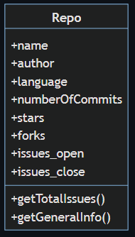
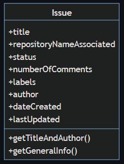
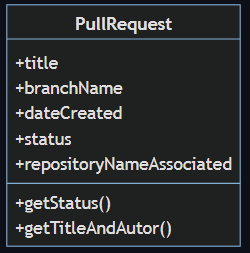

# Ejercicio 1

Modela los siguientes diagramas en objetos de JS:

Te resuelvo el primero (usa los `console.log()` para verificar que funcione):



```js
const repo = {
  name: "LaunchX",
  author: "carlogilmar",
  language: "JavaScript",
  numberOfCommits: 100,
  stars: 199,
  forks: 299,
  issues_open: 10,
  issues_close: 10,
  getTotalIssues: function(){
    return this.issues_open + this.issues_close
  },
  getGeneralInfo: function(){
    return `This repository ${this.name} was created by ${this.author}`
  }
}
console.log("Nombre del repo:" + repo.name)
console.log("Issues totales: " + repo.getTotalIssues())
console.log(repo.getGeneralInfo())
```





Esta actividad se trata de empezar a modelar información con objetos simples de JS como el ejercicio 1.
En el ejercicio anterior modelamos lo siguiente:

 - GitHub
    - repo
    - issue
    - pull_request

Ahora te pido modelar objetos de las siguientes plataformas, puedes desarrollar esto como tu gustes, ve a cada app y mira la información que puedes modelar. (Tu determinas los valores de cada llave, son meramente didacticos):

 - Twitter
    - user `const user = {user: "carlo", username: "carlogilmar", bio: "...", age: 23}`
    - trending_topic
    - hashtag
 - Facebook
    - user
    - post
    - biography
 - Uber
    - profile
    - travel
